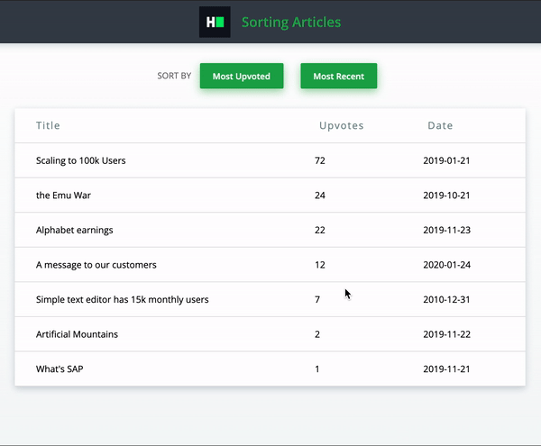

# Article Sorting

| desc | url | 
| ----------- | --|
|code repo |https://github.com/attila5287/hackerrank-react-article-sorting |
|live on vercel |https://hackerrank-react-article-sorting.vercel.app/ |
|solution 1   | [markdown](./solution1.md)  |

Create a React application called "Article Sorting" that displays a list of articles and allows users to sort them based on upvotes and publication date. Some core functionalities have already been implemented, but the application is not complete. Application requirements are detailed below, and the finished application must pass all of the unit tests.

Detailed Requirements

    The Articles component takes an array of articles as a prop. Each element of this array is an object with three properties: a string title, a number upvotes, and a string date in the format YYYY-MM-DD.
    By default, the articles should be displayed in a table ordered by the number of upvotes in descending order.
    Clicking on the "Most Upvoted" button should reorder and display the articles by the number of upvotes in descending order.
    Clicking on the "Most Recent" button should reorder and display the articles by date in descending order.
    You can assume that each article has a unique publish date and number of upvotes.

Sample Interaction

Initial State

    The articles are displayed in the table, ordered by the number of upvotes in descending order.
    The "Most Upvoted" button and the "Most Recent" button are displayed.

User Action 1

    User clicks "Most Recent" button.
    The articles are reordered and displayed by date in descending order.

User Action 2

    User clicks "Most Upvoted" button.
    The articles are reordered and displayed by the number of upvotes in descending order.

Hey there! Please enter the full-screen mode for the best experience

    BlogScoringEnvironmentFAQAbout UsHelpdeskCareersTerms Of ServicePrivacy Policy

